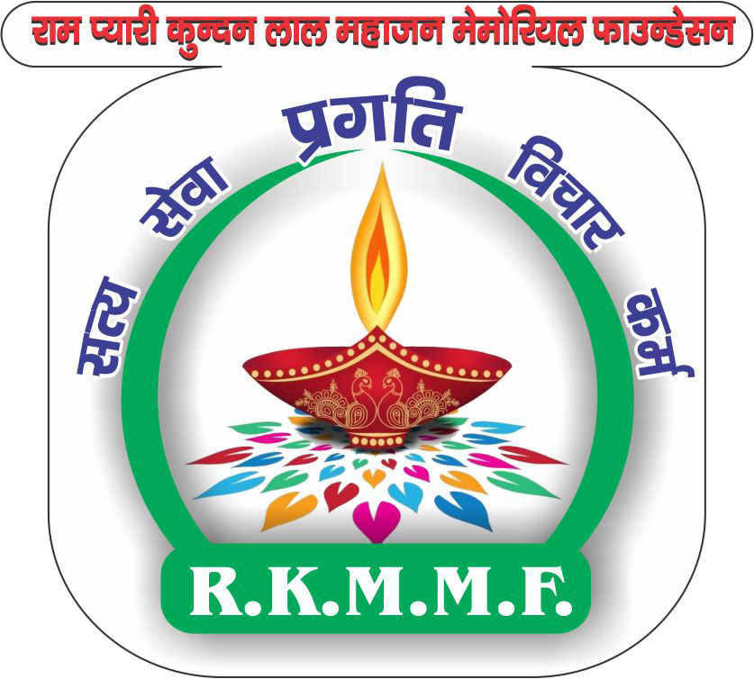
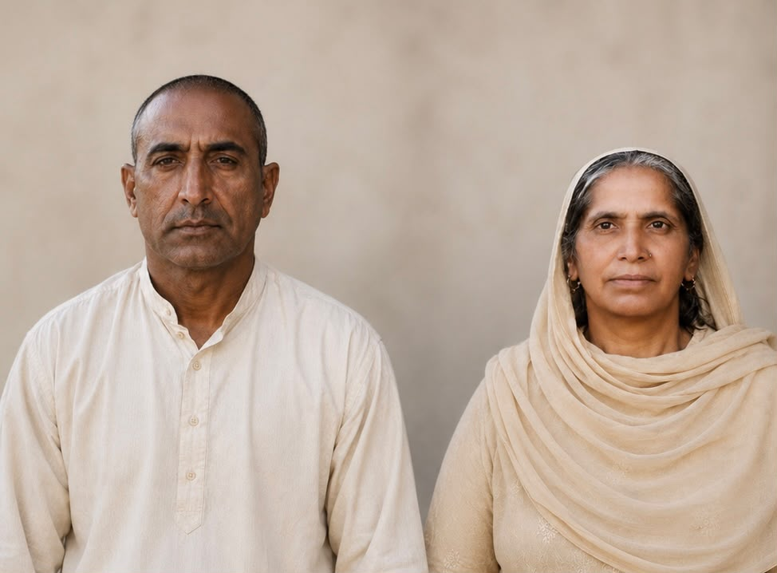
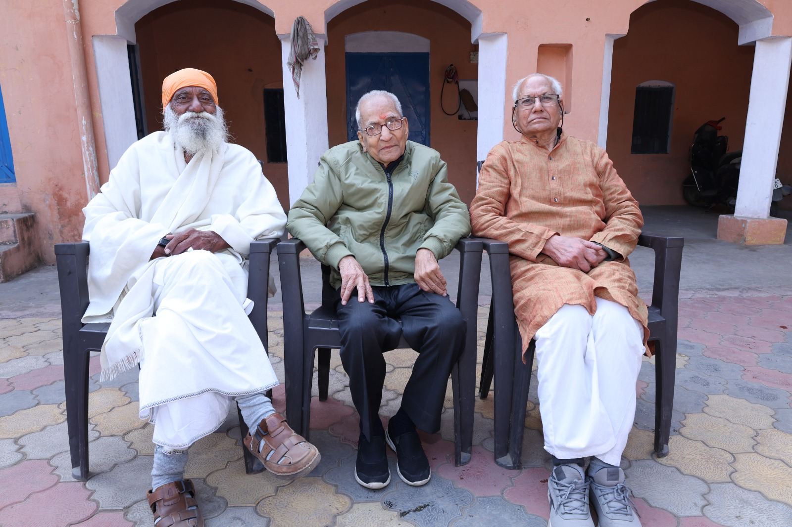
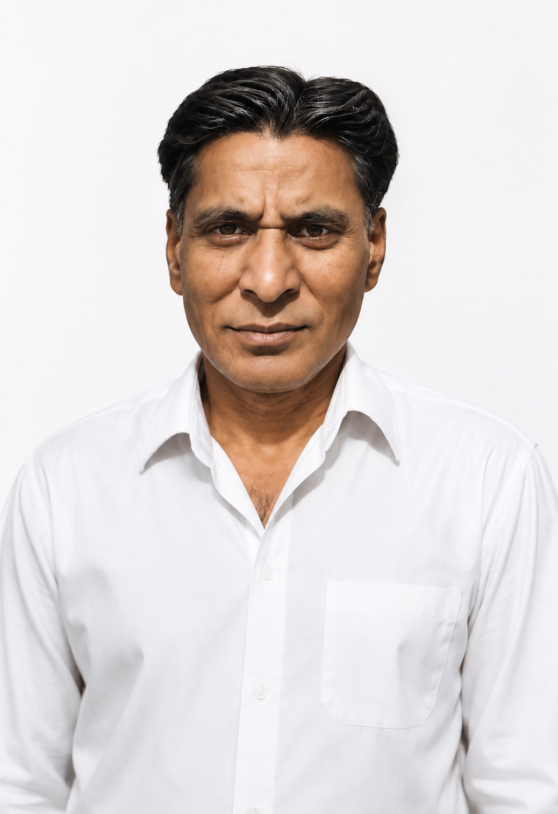
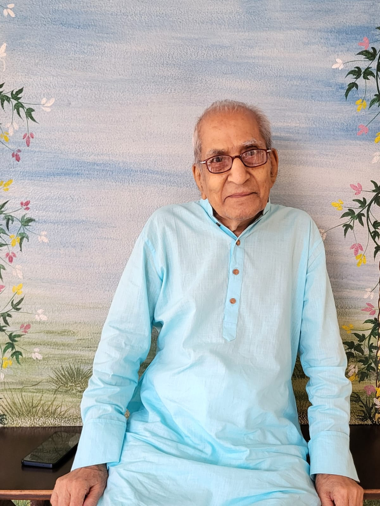
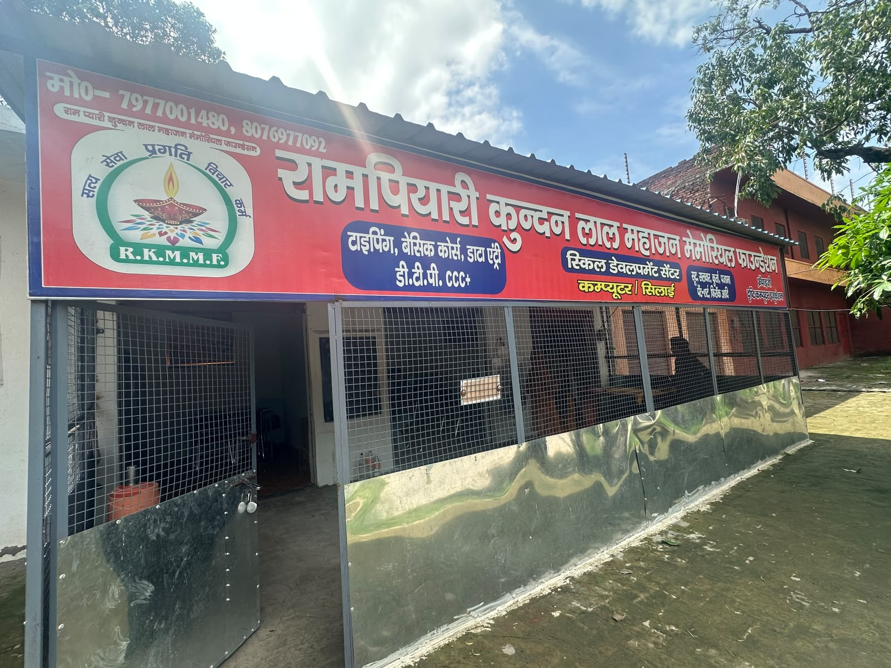

# Product Requirements Document
## Ram Pyari Kundan Lal Mahajan NGO — Website

**Version:** 1.0
**Status:** Draft for review — placeholders throughout marked `TODO`
**Owner:** NGO team
**Built as:** Static HTML / CSS / JS (no build tools required, deploy anywhere)

---

## 1. Purpose & Goals

Build a public website for the NGO that:
1. Tells the NGO's story and builds trust (About Us).
2. Showcases the two flagship courses and their **measurable impact**, with growing-number animation.
3. Highlights the **Drishti certification partnership** prominently, since it is a key credibility signal.
4. Shows real proof of work via photo carousels (Inauguration Day, Review Meetings).
5. Makes it effortless to **donate**, **volunteer**, or **enrol**, and to contact the trust (phone / email / map).

**Out of scope for v1:** payment gateway integration, CMS/admin panel, blog, multi-language support. Notes are left in the code (`TODO`) for where these can be added later.

---

## 2. Users

| User | Need |
|---|---|
| Prospective donor | Understand impact quickly, trust the org, donate easily |
| Rural woman / youth (or their family) | Understand what the course teaches, how long, how to enrol |
| Volunteer | Understand how to get involved |
| Partner / govt body / Drishti | See the partnership is real and visible |
| General visitor / press | Understand who the NGO is and what it has achieved |

---

## 3. Site Map

```
Home (index.html)
├── About Us (about.html)
│     └── #drishti — Drishti partnership section
├── Our Programs (programs.html)
│     ├── #tailoring — Tailoring Course for Rural Women
│     └── #dca — Diploma in Computer Application
├── Gallery (gallery.html)
│     ├── Inauguration Day (tab + carousel)
│     └── Review Meetings (tab + carousel)
└── Contact Us (contact.html)
      ├── #volunteer — Get in touch / contact form
      ├── #message-form — Send Us a Message form
      └── #donate — Donate section
```

Every page shares the same header (top bar + nav) and footer.

**Optional future pages** (mentioned by client as "nice to have", not required for v1):
- Events (if the NGO starts running public events/camps)
- Blog / News (updates, press mentions)
- Testimonials (dedicated page pulling quotes from graduates)

These are easy to add later using the same header/footer/section patterns already established.

---

## 4. Page-by-Page Requirements

### 4.1 Home (`index.html`)
- Top bar: social icons + 2 phone numbers + email.
- Header: logo + NGO name, nav (Home / About Us / Our Programs / Gallery / Contact Us), Donate Now button, mobile hamburger.
- Hero: headline + subtext + "Explore Our Programs" and "Donate Now" CTAs, background image placeholder.
- Action strip (3 cards): Enrol in a Course / Become a Volunteer / Support a Student.
- About snippet: short paragraph (placeholder for client's About text) + "Read Our Full Story" link.
- **Programs preview**: 2 cards (Tailoring, Computer Diploma) with course tag, duration, "Drishti Certified" badge, link to full detail on Programs page.
- **Impact counters** (dark teal band): 4 animated counters — women trained, students trained, certificates issued, active batches. Numbers count up from 0 when scrolled into view.
- **Drishti partnership banner**: dedicated, visually distinct section pairing NGO logo + Drishti logo, explaining the tie-up.
- Gallery preview: 1 carousel mixing a few Inauguration + Review images, "View Full Gallery" link.
- CTA band: donation call to action.
- Footer: brand blurb, quick links, programs links, contact details, social icons, copyright.

### 4.2 About Us (`about.html`)
- Page hero banner.
- About Us story (split layout, photo + paragraph — **placeholder marked for the client's supplied About Us text**).
- Mission / How We Work / Certified Outcomes — 3 value cards.
- **Drishti partnership detail section** (`#drishti`) — same visual treatment as home page banner, expanded text, anchor link used from nav/footer.
- Journey / timeline: Centre Inaugurated → Drishti Partnership Formalised → Ongoing Reviews (placeholder years/dates).
- CTA to Gallery.

### 4.3 Our Programs (`programs.html`)
- Page hero banner.
- Intro section.
- **Tailoring Course** (`#tailoring`): photo, description (placeholder for PDF content), **curriculum accordion** (4 sample modules — to be replaced module-by-module once the course PDF is provided), **impact counters** scoped to this course (women trained, batches completed, certificates issued), Enrol CTA.
- **Computer Diploma (DCA)** (`#dca`): photo, description, **curriculum accordion with all 8 real modules already filled in** from the brief (Computer Basics, Windows OS, Typing, MS Office, Internet & Email, Networking, Tally with GST, Files/Folders + Practical Work), impact counters scoped to this course, Enrol CTA.
- Drishti certification callout (repeated, course-specific framing).

### 4.4 Gallery (`gallery.html`)
- Page hero banner.
- Two tabs: **Inauguration Day** / **Review Meetings**, each backed by its own **image carousel** (arrows, dots, swipe, captions, autoplay).
- 5 placeholder slides per album (expandable).
- Explainer cards on how to swap in real photos / add new albums later.

### 4.5 Contact Us (`contact.html`)
- Page hero banner.
- **"Get in Touch"** panel (dark teal, matches client's reference layout): intro line, phone (both numbers), email, address, **Donate Now** + **Become a Volunteer** buttons.
- **"Send Us a Message"** form panel (cream): name, phone, email, reason dropdown, message, submit. Front-end only in v1 — needs a backend/email-service hookup (noted in code).
- **Map section**: Google Maps **Embed API** iframe with a clearly marked placeholder for the API key and address (`YOUR_GOOGLE_MAPS_API_KEY`).
- **Donate section** (`#donate`): CTA band; button currently opens a pre-filled email, marked for replacement with a real payment gateway / UPI link.

---

## 5. Content Inputs Needed From the Client

The site is fully built and wired with clearly marked `TODO` placeholders. To finish it, please supply:

| # | Item | Where it goes |
|---|---|---|
| 1 | NGO logo (transparent PNG/SVG) | `assets/images/logo-ngo.svg` (replace) |
| 2 | Drishti logo | `assets/images/logo-drishti.svg` (replace) |
| 3 | About Us paragraph(s) | `about.html` story section + `index.html` snippet |
| 4 | Inauguration Day photos (as many as you have) | `assets/images/gallery-inauguration-*.jpg` |
| 5 | Review Meeting photos | `assets/images/gallery-review-*.jpg` |
| 6 | Tailoring course curriculum PDF | Expands the 4 sample modules in `programs.html#tailoring` into the real ones |
| 7 | Confirmed real impact numbers (students trained, certificates issued, batches, etc.) | `data-target` attributes in `index.html` and `programs.html` |
| 8 | Registered address | `contact.html` address block + map `q=` parameter |
| 9 | Google Maps API key | `contact.html` map iframe `key=` parameter |
| 10 | Donation method (UPI ID / payment gateway account) | `contact.html` `#donate` button link |
| 11 | Social media links (Facebook, Instagram, WhatsApp, LinkedIn) | Top bar & footer icons in every page |
| 12 | Hero / general photography (optional, beyond gallery) | `assets/images/hero-main.jpg`, `about-*.jpg`, `program-*.jpg` |

### How to send images
Upload them directly in this chat (drag-and-drop or the attach button) — once received, they can be dropped straight into `assets/images/` under the matching filename shown above, so nothing else in the code needs to change.

---

## 6. Design System

Derived from the client's reference screenshot (donation-NGO template, teal + saffron).

| Token | Value | Use |
|---|---|---|
| `--teal-900` | `#1c3b3b` | Header text/bg, dark sections, primary brand color |
| `--saffron-500` | `#e8952e` | Primary accent, CTAs, highlights |
| `--cream-100` | `#faf7f1` | Alternate section background |
| `--white` | `#ffffff` | Base background |
| Display font | Poppins (600/700) | Headings |
| Body font | Work Sans (400/500/600) | Body copy, UI |

- Rounded pill buttons, soft card shadows, rounded-corner imagery — matches the warm, approachable NGO tone from the reference.
- Dark teal used for header/footer/banners; saffron reserved for CTAs and key highlights (Drishti banner, counters, buttons) so it doesn't get diluted.

---

## 7. Key Interactive Behaviours

1. **Animated impact counters** — count up from 0 to target value when scrolled into view (`IntersectionObserver` + `requestAnimationFrame`), used on Home (site-wide impact) and Programs (per-course impact).
2. **Image carousels** — arrows, dot navigation, autoplay (5s), touch-swipe support; used for Gallery (2 albums) and Home gallery preview.
3. **Curriculum accordion** — expandable module list on Programs page.
4. **Responsive nav** — collapses to a hamburger menu under ~940px.
5. **Contact form** — client-side validation + confirmation message; needs backend wiring (see `TODO` in `contact.html`).

---

## 8. Technical Notes

- Pure HTML/CSS/JS, no framework or build step — open `index.html` directly or host on any static host (Netlify, GitHub Pages, Hostinger, etc.).
- All images are SVG placeholders with descriptive labels (e.g. `program-tailoring.jpg.svg`) so it's obvious what to replace and where.
- Google Fonts loaded via CDN (`Poppins`, `Work Sans`) — requires internet access when the site is viewed.
- Google Maps requires an **Embed API key** (free tier available from Google Cloud Console) — placeholder is clearly marked in `contact.html`.
- Accessibility: visible focus states, semantic headings, alt text on all images, `prefers-reduced-motion` respected.

---

## 9. Open Questions for the Client

1. Do you want the **Donate Now** button to link to a payment gateway (Razorpay/Instamojo/PayU), a UPI QR code, or bank details displayed on the page?
2. Should the contact form deliver messages by email (e.g. via Formspree) or do you have a backend/CRM it should post to?
3. Any additional courses planned beyond Tailoring and DCA, that the Programs page should be built to scale to?
4. Do you want testimonials/quotes from graduates included anywhere (Home or a dedicated page)?


<!-- <span>Yogender K. Gupta</span>
          <span>Ved Prakash Gupta</span>
          <span>Chanan Prakash Mahajan</span> -->
<<<<<<< HEAD


<!-- <!DOCTYPE html>
<html lang="en">
<head>
<meta charset="UTF-8">
<meta name="viewport" content="width=device-width, initial-scale=1.0">
<title>About Us | Ram Pyari Kundan Lal Mahajan NGO</title>
<link rel="preconnect" href="https://fonts.googleapis.com">
<link href="https://fonts.googleapis.com/css2?family=Poppins:wght@500;600;700&family=Work+Sans:wght@400;500;600&display=swap" rel="stylesheet">
<link rel="stylesheet" href="css/style.css">
<style>
  /* Pull-quote style for tribute/legacy quotes, matches site tokens */
  .quote-block {
    position: relative;
    margin-top: 22px !important;
    padding: 20px 24px 20px 28px;
    background: var(--cream-100);
    border-left: 3px solid var(--saffron-500);
    border-radius: var(--radius-sm);
  }
  .quote-block b {
    color: var(--teal-900);
    font-style: italic;
    font-size: 16.5px;
    line-height: 1.6;
  }

  /* ============ Names row under the Our Story photo ============ */
  .name-row {
    display: flex;
    align-items: center;
    justify-content: space-between;
    gap: 12px;
    margin-top: 14px;
    padding: 12px 18px;
    background: var(--white);
    border: 1px solid var(--line);
    border-radius: var(--radius-md);
    box-shadow: var(--shadow-card);
  }
  .name-row span {
    font-family: var(--font-display);
    font-weight: 700;
    font-size: 15px;
    letter-spacing: 0.06em;
    color: var(--teal-900);
    text-transform: uppercase;
  }
  .name-row span:not(:last-child) {
    position: relative;
    padding-right: 12px;
  }
  .name-row span:not(:last-child)::after {
    content: "";
    position: absolute;
    right: 0;
    top: 50%;
    transform: translateY(-50%);
    width: 5px;
    height: 5px;
    border-radius: 50%;
    background: var(--saffron-500);
  }
  @media (max-width: 560px) {
    .name-row { padding: 10px 14px; }
    .name-row span { font-size: 13px; }
  }

  /* ============ Two-photo stacked frame (Father's Legacy) ============ */
  .stacked-photo-frame {
    display: flex;
    flex-direction: column;
    gap: 10px;
    padding: 10px;
    background: var(--white);
    border: 1px solid var(--line);
    border-radius: var(--radius-lg);
    box-shadow: var(--shadow-card);
  }
  .stacked-photo-frame .frame-slot {
    width: 100%;
    aspect-ratio: 11 / 10;
    overflow: hidden;
    border-radius: var(--radius-md);
    background: var(--cream-200);
  }
  .stacked-photo-frame .frame-slot img {
    width: 100%;
    height: 100%;
    display: block;
    object-fit: cover;
    object-position: center top;
  }
  .stacked-photo-frame .caption {
    display: block;
    text-align: center;
    margin-top: 4px;
    font-family: var(--font-display);
    font-weight: 700;
    font-size: 15px;
    color: var(--teal-900);
    letter-spacing: 0.02em;
  }
  @media (max-width: 560px) {
    .stacked-photo-frame { padding: 8px; gap: 8px; }
    .stacked-photo-frame .caption { font-size: 13.5px; }
  }

  /* ============ Founder photo (single) — hosts an overlapping inset
     photo popping out of the bottom-right corner ============ */
  .founder-photo-frame {
    position: relative;
    padding: 10px;
    background: var(--white);
    border: 1px solid var(--line);
    border-radius: var(--radius-lg);
    box-shadow: var(--shadow-card);
    overflow: visible;
    margin-bottom: 70px; /* reserve space for the part hanging outside */
    isolation: isolate;  /* keep this card's own stacking context clean */
  }
  .split-media {
    overflow: visible !important;
  }
  .founder-photo-frame .frame-slot {
    width: 100%;
    overflow: hidden;
    border-radius: var(--radius-md);
    background: var(--cream-200);
  }
  .founder-photo-frame .frame-slot img {
    width: 100%;
    height: auto;
    display: block;
  }
  .founder-photo-frame .caption {
    display: block;
    text-align: center;
    margin-top: 12px;
    font-family: var(--font-display);
    font-weight: 700;
    font-size: 15px;
    color: var(--teal-900);
    letter-spacing: 0.02em;
  }
  @media (max-width: 560px) {
    .founder-photo-frame { padding: 8px; }
    .founder-photo-frame .caption { font-size: 13.5px; margin-top: 10px; }
  }

  /* ============ Overlapping inset photo (Shri Kundan Lal) — sits on
     top of the main founder photo's bottom-right corner, popping
     partly outside the card, both names fully visible ============ */
  .inline-photo-card {
    position: absolute;
    right: -30px;
    bottom: -50px;
    width: 32%;
    max-width: 170px;
    min-width: 110px;
    margin: 0;
    padding: 6px;
    background: var(--white);
    border: 3px solid var(--white);
    border-radius: var(--radius-md);
    box-shadow: 0 10px 24px rgba(0,0,0,0.28);
    text-align: center;
    z-index: 5;
  }
  .inline-photo-card .frame-slot {
    width: 100%;
    height: 0;
    padding-bottom: 100%;
    position: relative;
    overflow: hidden;
    border-radius: var(--radius-sm);
    background: var(--cream-200);
  }
  .inline-photo-card .frame-slot img {
    position: absolute;
    inset: 0;
    width: 100%;
    height: 100%;
    display: block;
    object-fit: cover;
    object-position: center 15%;
  }
  .inline-photo-card .caption {
    display: block;
    margin-top: 6px;
    font-family: var(--font-display);
    font-weight: 700;
    font-size: 11.5px;
    color: var(--teal-900);
    white-space: nowrap;
  }
  @media (max-width: 880px) {
    .founder-photo-frame { margin-bottom: 52px; }
    .inline-photo-card { right: -20px; bottom: -44px; width: 30%; }
  }
  @media (max-width: 560px) {
    .founder-photo-frame { margin-bottom: 44px; }
    .inline-photo-card {
      right: -12px;
      bottom: -36px;
      width: 36%;
      max-width: 130px;
      padding: 4px;
    }
    .inline-photo-card .caption { font-size: 10px; margin-top: 4px; }
  }

  /* ============ Foundation hero header (Ram Pyari & Kundan Lal) ============
     The names ARE the foundation's name — this section presents their
     photo and names as the foundation's identity, right under the page
     hero, so visitors immediately see who the foundation honours. */
  .founders-hero {
    position: relative;
    padding: 64px 0 56px;
    background:
      radial-gradient(circle at 15% 20%, rgba(212,163,63,0.10), transparent 55%),
      radial-gradient(circle at 85% 80%, rgba(15,76,73,0.08), transparent 55%),
      var(--cream-100);
    overflow: hidden;
  }
  .founders-hero::before {
    content: "";
    position: absolute;
    inset: 0;
    background-image: repeating-linear-gradient(135deg, rgba(15,76,73,0.035) 0 2px, transparent 2px 26px);
    pointer-events: none;
  }
  .founders-hero-inner {
    position: relative;
    display: flex;
    flex-direction: column;
    align-items: center;
    text-align: center;
    max-width: 720px;
    margin: 0 auto;
  }
  .founders-hero .eyebrow-pill {
    display: inline-flex;
    align-items: center;
    gap: 8px;
    padding: 7px 18px;
    background: var(--white);
    border: 1px solid var(--line);
    border-radius: 999px;
    box-shadow: var(--shadow-card);
    font-family: var(--font-display);
    font-weight: 700;
    font-size: 12.5px;
    letter-spacing: 0.14em;
    text-transform: uppercase;
    color: var(--saffron-500);
    margin-bottom: 18px;
  }
  .founders-hero .eyebrow-pill::before {
    content: "";
    width: 6px;
    height: 6px;
    border-radius: 50%;
    background: var(--saffron-500);
  }
  .founders-hero h2 {
    margin: 0 0 6px;
    font-size: clamp(26px, 4vw, 38px);
    line-height: 1.2;
  }
  .founders-hero h2 a {
    color: var(--teal-900);
    text-decoration: none;
    background-image: linear-gradient(var(--saffron-500), var(--saffron-500));
    background-repeat: no-repeat;
    background-position: 0 100%;
    background-size: 0% 2px;
    transition: background-size 0.25s ease;
    padding-bottom: 2px;
  }
  .founders-hero h2 a:hover {
    background-size: 100% 2px;
  }
  .founders-hero .tagline {
    max-width: 480px;
    margin: 0 auto 30px;
    color: #5c6660;
    font-size: 15.5px;
    line-height: 1.65;
  }

  .founders-portrait {
    position: relative;
    width: 100%;
    max-width: 420px;
    background: var(--white);
    border-radius: var(--radius-lg);
    box-shadow: 0 18px 44px rgba(15,76,73,0.16);
    overflow: hidden;
  }
  .founders-portrait > img {
    width: 100%;
    height: auto;
    display: block;
  }
  .founders-portrait .names-plate {
    margin-top: 0;
    padding: 14px 12px 0;
    display: flex;
    align-items: center;
    justify-content: center;
    gap: 10px;
    font-family: var(--font-display);
    font-weight: 700;
    font-size: 16px;
    letter-spacing: 0.03em;
    color: var(--teal-900);
  }
  .founders-portrait .names-plate .amp {
    color: var(--saffron-500);
    font-style: italic;
    font-weight: 600;
    font-size: 14px;
  }
  .founders-portrait .foundation-tag {
    display: block;
    margin-top: 4px;
    padding: 0 12px 14px;
    text-align: center;
    font-size: 11.5px;
    letter-spacing: 0.16em;
    text-transform: uppercase;
    color: #8a8378;
  }
  @media (max-width: 560px) {
    .founders-hero { padding: 48px 0 40px; }
    .founders-portrait { max-width: 300px; }
    .founders-portrait .names-plate { font-size: 14px; }
  }

  /* ============ General attractiveness pass: card lift on hover ============ */
  .value-card {
    transition: transform 0.25s ease, box-shadow 0.25s ease;
  }
  .value-card:hover {
    transform: translateY(-4px);
    box-shadow: 0 16px 32px rgba(15,76,73,0.12);
  }
  .cta-band {
    position: relative;
    overflow: hidden;
  }
  .cta-band::after {
    content: "";
    position: absolute;
    inset: 0;
    background: radial-gradient(circle at 90% 10%, rgba(212,163,63,0.18), transparent 60%);
    pointer-events: none;
  }
</style>
</head>
<body>

<header class="site-header">
  <div class="container">
    <a href="index.html" class="brand">
      
      <span class="brand-text">
        <span class="full">Ram Pyari Kundan Lal Mahajan</span>
<span class="tag">Memorial Foundation(R.K.M.M.F)</span> 
      </span>
    </a>
           <nav class="nav-links" id="nav-links">
      <a href="index.html">Home</a>
      <a href="about.html" aria-current="page">About Us</a>
      <a href="programs.html">Our Programs</a>
      <a href="Inauguration.html">Inauguration</a>
      <a href="gallery.html">Gallery</a>
      <a href="contact.html">Contact Us</a>
    </nav>
    <div class="header-actions">
      <button class="nav-toggle" aria-label="Toggle menu" aria-expanded="false" aria-controls="nav-links">
        <span></span><span></span><span></span>
      </button>
    </div>
  </div>
</header>

<section class="page-hero">
  <div class="page-hero-bg"></div>
  <div class="container">
    <h1>About Us</h1>
    <p class="breadcrumb"><a href="index.html">Home</a> / About Us</p>
  </div>
</section>

<!-- ============ FOUNDATION NAMESAKES: Ram Pyari & Kundan Lal ============
     The foundation is literally named after this couple — this section
     presents their photo and names as the foundation's own identity. -->
<!-- <section class="founders-hero">
  <div class="container founders-hero-inner">
    <!-- <span class="eyebrow-pill">The Foundation's Namesake</span> -->
    <!-- <h2><a href="index.html">Ram Pyari Kundan Lal Mahajan</a></h2>
    <p class="tagline">
      Every course we teach and every life we touch carries their name —
      a memorial foundation built to honour their memory and continue
      their legacy of courage and service.
    </p>

    <div class="founders-portrait">
      
      <div class="names-plate">
        <span>Shri Kundan Lal</span>
        <span class="amp">&amp;</span>
        <span>Ram Pyari</span>
      </div>
      <span class="foundation-tag">In loving memory</span>
    </div>
  </div> -->
<!-- </section> -->

<!-- ============ ABOUT US CONTENT ============ -->
<section>
  <div class="container">
    <div class="split">
      <div class="split-media">
        
        <div class="name-row">
          <span>Yogender K. Gupta</span>
          <span>Ved Prakash Gupta</span>
          <span>Chanan Prakash Mahajan</span>
        </div>
      </div>
      <div class="split-body">
        <p class="eyebrow">Our Story</p>
        <h2>Building Livelihoods, One Certificate at a Time</h2>
        <p>
          The Ram Pyari Kundan Lal Mahajan Charitable Trust was founded to honour the memory of Late Shri Kundanlal Mahajan, whose extraordinary courage and selfless sacrifice during the 1947 tribal invasion of Jammu & Kashmir continue to inspire generations.
        </p>
        <p>To carry forward his legacy of service, the Trust established the Ram Pyari Kundan Lal Mahajan Skill Development Centre at Shukartal, Muzaffarnagar. In partnership with Drishti Computer Education and Youth Skill Development & Research Institute, the centre provides free Computer and Sewing & Tailoring courses for youth, women, and economically weaker sections of society.</p>
        <p>We believe that education and skill development create opportunities, promote self-reliance, and transform lives. Every student we empower is a tribute to the values of courage, compassion, and service that Shri Kundanlal Mahajan embodied.</p>
        <p class="quote-block">
          <b>"His courage lives on through every life empowered, every skill learned, and every act of selfless service."</b>
        </p>
      </div>
    </div>
  </div>
</section>

<!-- ============ FATHER'S LEGACY ============ -->
<!-- <section class="bg-cream">
  <div class="container">
    <div class="split reverse">
      <div class="split-media">
        <div class="stacked-photo-frame">
          <div class="frame-slot">
            
          </div>
          <span class="caption">OM Prakash Gupta</span>
        </div>
      </div>
      <div class="split-body">
        <p class="eyebrow">A Father's Legacy</p>
        <h2>The Sacrifice That Shaped Our Journey</h2>
        <p class="quote-block">
          <b>"His dedication and sacrifice became the foundation upon which we built our lives."</b>
        </p>
      </div>
    </div>
  </div>
</section> -->

<!-- ============ OUR FOUNDER ============ -->
<section>
  <div class="container">
    <div class="split">
       <div class="split-media">
        <div class="founder-photo-frame">
          <div class="frame-slot">
            
          </div>
          <span class="caption">Ved Prakash Gupta</span>
        </div>
      </div>
      <div class="split-body">
        <p class="eyebrow">Founder</p>
        <h2>Meet Our Founder</h2>
        <p>
I am <b>Ved Prakash Gupta, a native of Ali Beg, District Mirpur (PoK).</b>
</p>

<p>During the tribal invasion of 1947, my late father, <b>Shri Kundan Lal</b>, made the supreme sacrifice while protecting the honour of a young girl. After his martyrdom, our family came to Delhi as refugees. Through hard work, perseverance, and the support of my elder brother, we rebuilt our lives and ensured that every member of our family was educated and settled.</p>

<p>One day, while sitting quietly in my room, I experienced a profound inner calling to do something meaningful in my father's memory and for the welfare of society. I accepted this as a divine inspiration and a responsibility to dedicate the remaining years of my life to serving others.</p>

<p>With the wholehearted support of my family, I established this charitable trust and our Skill Development Centre, which provides <b>free computer education and sewing training</b> to help youth and women become self-reliant.</p>

<p>I humbly invite everyone to join us in carrying forward the ideals of courage, compassion, sacrifice, and selfless service.</p>
        </p>
        <p>With sincere gratitude,<br>
        <b>Ved Prakash Gupta</b><br>
        <b>Founder Trustee</b></p>
      </div>
    </div>
  </div>
</section>

<!-- ============ MISSION / VISION / VALUES ============ -->
<section class="bg-cream">
  <div class="container">
    <div class="section-head">
      <p class="eyebrow" style="justify-content:center">What drives us</p>
      <h2>Our Mission &amp; Values</h2>
    </div>
    <div class="value-grid">
      <div class="value-card">
        <div class="icon">🎯</div>
        <h3>Our Mission</h3>
        <p>To equip rural women and unemployed youth with certified, job-ready skills that create real, lasting income.</p>
      </div>
      <div class="value-card">
        <div class="icon">🤝</div>
        <h3>How We Work</h3>
        <p>Small batches, hands-on training, and close mentorship — every student is tracked from enrolment to placement.</p>
      </div>
      <div class="value-card">
        <div class="icon">🎓</div>
        <h3>Certified Outcomes</h3>
        <p>Every graduate receives a certificate co-issued with our training partner Drishti, recognised by employers.</p>
      </div>
    </div>
  </div>
</section>

<!-- ============ DRISHTI PARTNERSHIP (detailed) ============ -->
<section id="drishti">
  <div class="container">
    <div class="partner-banner">
      <div class="partner-banner-bg"></div>
      <div>
        <p class="eyebrow">Certification Partner</p>
        <h2>Our Tie-Up With Drishti</h2>
        <p>
          We partner with Drishti to certify every student who completes our tailoring or
          computer diploma course. This partnership means our certificates carry recognised
          credibility, giving graduates a real advantage when they apply for jobs or start
          their own small enterprise.
        </p>
        <a href="programs.html" class="btn btn-primary" style="margin-top:20px">See Certified Courses</a>
      </div>
      <div class="partner-logos">
        <div class="plate"></div>
        <span class="x">×</span>
        <div class="plate"></div>
      </div>
    </div>
  </div>
</section>

<!-- ============ JOURNEY / TIMELINE ============ -->
<section class="bg-cream">
  <div class="container">
    <div class="split">
      <div class="split-media">
        
      </div>
      <div class="split-body">
        <p class="eyebrow">Our Journey</p>
        <h2>Milestones So Far</h2>
        <div class="timeline" style="margin-top:24px">
          <div class="timeline-item">
            <span class="yr">Year 1</span>
            <h4>Centre Inaugurated</h4>
            <p>Our first training centre opened its doors to the local community.</p>
          </div>
          <div class="timeline-item">
            <span class="yr">Year 1</span>
            <h4>Drishti Partnership Formalised</h4>
            <p>Certification tie-up established, adding credibility to every graduate's diploma.</p>
          </div>
          <div class="timeline-item">
            <span class="yr">Ongoing</span>
            <h4>Regular Review Meetings</h4>
            <p>Quarterly reviews with our team and partners to track student outcomes and improve course delivery.</p>
          </div>
        </div>
      </div>
    </div>
  </div>
</section>

<section>
  <div class="container">
    <div class="cta-band">
      <h2>Want to see our students' work up close?</h2>
      <a href="gallery.html" class="btn btn-dark">Visit the Gallery</a>
    </div>
  </div>
</section>

<footer class="site-footer">
  <div class="container footer-top">
    <div class="footer-brand">
      <a href="index.html" class="brand">
        
        <span class="brand-text"><span class="full">Ram Pyari Kundan Lal Mahajan</span></span>
      </a>
      <p>Skilling rural women and youth through free, certified tailoring and computer diploma courses — in partnership with Drishti.</p>
      <div class="footer-social">
        <a href="#" aria-label="Facebook">f</a>
        <a href="#" aria-label="Instagram">ig</a>
        <a href="#" aria-label="WhatsApp">wa</a>
        <a href="#" aria-label="LinkedIn">in</a>
      </div>
    </div>
    <div class="footer-col">
      <h4>Quick Links</h4>
      <ul>
        <li><a href="about.html">About Us</a></li>
        <li><a href="programs.html">Our Programs</a></li>
        <li><a href="gallery.html">Gallery</a></li>
        <li><a href="contact.html">Contact Us</a></li>
      </ul>
    </div>
    <div class="footer-col">
      <h4>Programs</h4>
      <ul>
        <li><a href="programs.html#tailoring">Tailoring Course</a></li>
        <li><a href="programs.html#dca">Computer Diploma</a></li>
        <li><a href="about.html#drishti">Drishti Partnership</a></li>
      </ul>
    </div>
    <div class="footer-col">
      <h4>Get in Touch</h4>
      <ul>
        <li><a href="tel:+917977001480">+91 79770 01480</a></li>
        <li><a href="tel:+918076977092">+91 80769 77092</a></li>
        <li><a href="mailto:rkmmftrust@gmail.com">rkmmftrust@gmail.com</a></li>
      </ul>
    </div>
  </div>
  <div class="container footer-bottom">
    <span>©️ 2026 Ram Pyari Kundan Lal Mahajan NGO. All rights reserved.</span>
    <span>Registered Charitable Trust</span>
  </div>
</footer>

<script src="js/script.js"></script>
</body>
</html> -->
=======
>>>>>>> dbae53c09fff1198b69f11e62e909743621f354d
